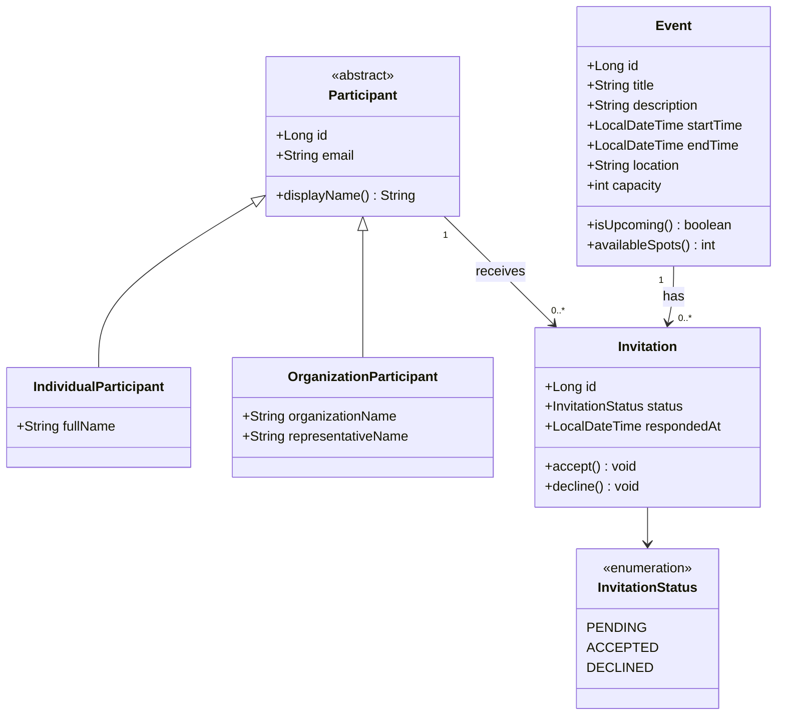
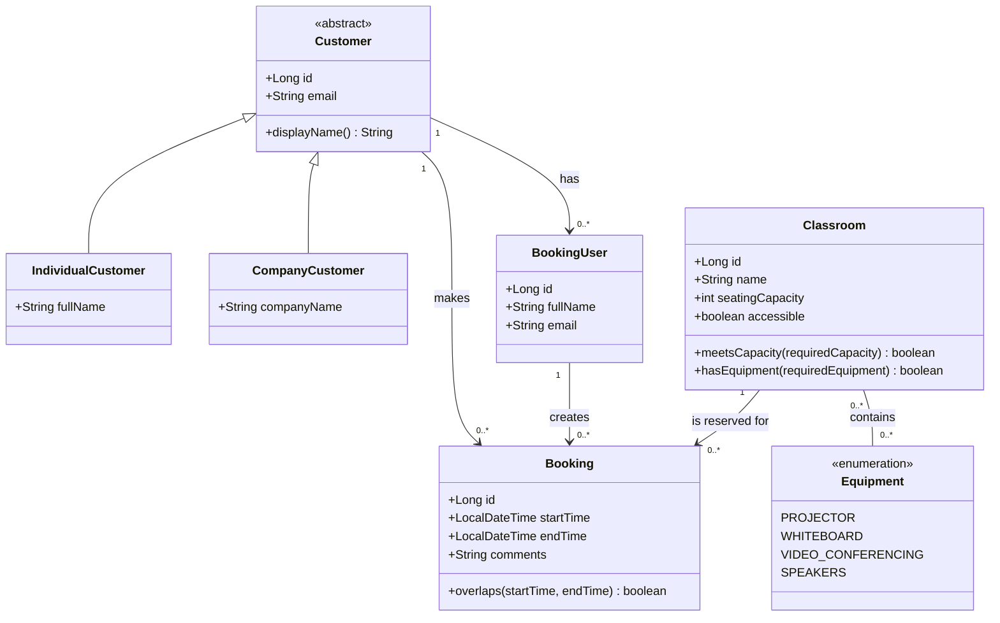

# Project-test-1

## UML Class Diagram — Event Management App



Design rules: an invitation links exactly one participant to one event; the
combination of event and participant must be unique. Only accepted invitations
count toward an event's capacity.

## UML Class Diagram — Classroom Rental App



Design rules: a booking belongs to one customer, is created by one booking user,
and reserves one classroom. A classroom can only be booked when its capacity,
equipment, accessibility, and time availability meet the customer's request.

# Preliminary Implementation Plans

These plans are intentionally preliminary. They identify decisions that should
be settled before implementation and divide the work into stages that can be
implemented, tested, and committed separately.

## Approach Shared by Both Projects

Both applications should use the same general structure:

```text
src/main/java/
  domain/            Domain objects and enums
  service/           Business rules and use cases
  repository/        Persistence interfaces
  repository/jdbc/   JDBC implementations
  ui/                Console menus and input handling
  config/            Database configuration
  exception/         Application-specific exceptions

src/main/resources/
  schema.sql
  seed.sql

src/test/java/
  domain/
  service/
  repository/
```

The domain and service layers should not depend on `Scanner`, SQL, or JDBC.
This makes the important rules testable without running the console or database.
The console should collect input and display results, while repositories should
only load and save data.

Before choosing either project, confirm:

- Required Java version and whether Maven may be used.
- Required database engine. MySQL is a practical candidate, but the project
  should not be committed to it until the course requirement is confirmed.
- Whether Docker is permitted for starting the database.
- Whether the instructor expects full CRUD or only the operations explicitly
  listed in the assignment.
- Whether schema and seed scripts must be included in the repository.

Common early risks include unavailable database connections, leaked credentials,
missing JDBC drivers, and a schema that becomes difficult to change. The first
technical milestone should therefore be a small database connection test with
configuration read from ignored local settings. No business features should be
built on JDBC until that test works reliably.

## Preliminary Plan — Event Management App

### Proposed Scope Decisions

The following rules are reasonable interpretations, but should be confirmed or
documented as assumptions before implementation:

- One invitation represents one place at an event, including an invitation sent
  to an organization representative.
- Invitations may exceed capacity while pending; capacity is enforced when an
  invitation is accepted.
- Changing an accepted invitation to declined releases its place.
- An event's capacity cannot be lowered below its accepted participant count.
- An invitation is unique for one event and one participant.
- An upcoming event is an event whose start time has not passed.
- Events in the past cannot receive new invitations or status changes.
- Deleting a participant or event with invitation history is restricted rather
  than silently deleting related records.

These decisions prevent the implementation from inventing rules in different
parts of the program later.

### Stage 1 — Repository, Tooling, and Database Spike

**Work**

- Create the new project repository required by the assignment.
- Add the Maven structure, `.gitignore`, README outline, and test framework.
- Select the Java and database versions.
- Add local configuration without committing passwords.
- Prove that the application can connect, run `SELECT 1`, and close cleanly.

**Problems likely to appear**

- Maven may not find the intended JDK or may use the wrong local repository.
- The JDBC driver version may not match the database setup.
- Docker Desktop or the database server may not be running.
- Hardcoded credentials may accidentally be committed.
- Starting with the entire schema can hide basic connection problems.

**Risk control and completion condition**

Use one documented startup path and one connection configuration format. Add an
example configuration containing placeholders and ignore the real local file.
This stage is complete when a clean checkout can compile, run tests, and connect
using the documented instructions.

### Stage 2 — Domain Model and Validation

**Work**

- Implement `Participant`, `IndividualParticipant`,
  `OrganizationParticipant`, `Event`, `Invitation`, and `InvitationStatus`.
- Validate required text, positive capacity, and `startTime < endTime`.
- Keep domain objects independent of database-generated IDs where possible.
- Add tests for valid and invalid construction.

**Problems likely to appear**

- The inheritance model may create fields that only apply to one participant
  subtype.
- Mutable invitation collections may allow callers to bypass event rules.
- Equality based only on a database ID behaves badly before an object is saved.
- Repeated date/time validation can become inconsistent.

**Risk control and completion condition**

Keep subtype-specific fields in their subclasses, expose collections as
read-only views, and centralize time validation. Avoid using unsaved entities as
hash keys unless equality has been designed for that case. This stage is done
when domain tests pass without a database or console.

### Stage 3 — Repository Contracts and In-Memory Prototype

**Work**

- Define repository interfaces for participants, events, and invitations.
- Implement simple in-memory repositories for early development and tests.
- Build service methods for registering participants, creating events, sending
  invitations, and finding records by ID.

**Problems likely to appear**

- Business rules may accidentally be divided between repository and service
  implementations.
- In-memory behavior may differ from SQL uniqueness and foreign-key behavior.
- Generated IDs may be handled differently in the two repository types.

**Risk control and completion condition**

Repositories enforce storage concerns; services enforce application rules.
Define the same interface contract for missing records, assigned IDs, and saved
objects. This stage is done when a complete basic workflow works in memory.

### Stage 4 — Invitation and Capacity Rules

**Work**

- Prevent duplicate invitations.
- Define permitted status transitions.
- Count accepted invitations and calculate available places.
- Prevent acceptance when the event is full.
- Decide how event edits interact with existing invitations.

**Problems likely to appear**

- Checking capacity when inviting instead of accepting would incorrectly block
  pending invitations.
- Repeated acceptance of the same invitation could be counted twice.
- Lowering event capacity could leave invalid existing data.
- Two nearly simultaneous accept operations could both see the final free place.

**Risk control and completion condition**

Put status transitions in one service operation and make repeated updates
predictable. When JDBC is introduced, acceptance must run in a transaction that
rechecks capacity before updating. Tests should cover full capacity, duplicate
invitations, repeated status changes, and releasing a place after decline.

### Stage 5 — SQL Schema and JDBC Repositories

**Work**

- Create `participants`, `events`, and `invitations` tables.
- Add primary keys, foreign keys, required columns, and check constraints where
  supported.
- Add a unique constraint on `(event_id, participant_id)`.
- Implement JDBC repositories with prepared statements and try-with-resources.
- Add integration tests against an isolated test database/schema.

**Problems likely to appear**

- Participant inheritance does not map automatically to a relational table.
- Enum names may drift between Java and SQL.
- `LocalDateTime` conversion may lose precision or be interpreted inconsistently.
- Cascading deletes could erase invitation history unexpectedly.
- A successful compile does not prove that SQL queries return correctly mapped
  objects.

**Risk control and completion condition**

Use a participant type discriminator and document nullable subtype fields, or
use subtype tables only if the extra complexity is justified. Store enum values
by stable names, explicitly define foreign-key delete behavior, and test every
mapping in both directions. This stage is done when repository integration tests
exercise create, read, update, duplicate rejection, and related-record queries.

### Stage 6 — Queries, Collections, Streams, and Lambdas

**Work**

- List upcoming events sorted by start time.
- Find invitations for an event and optionally filter by status.
- Find all events for a participant.
- Produce an attendance list containing accepted participants.
- Calculate available places.

**Problems likely to appear**

- Loading everything into memory may make JDBC look unnecessary.
- Performing all filtering in SQL may fail to demonstrate streams and lambdas.
- Repeated loading of related entities can cause many small queries.
- Capturing the current time separately in tests makes upcoming-event tests
  unstable.

**Risk control and completion condition**

Use SQL for selecting the relevant records and streams for meaningful
application-level filtering, mapping, and sorting. Pass a `Clock` or reference
time into time-dependent logic so tests remain deterministic. This stage is done
when every required view has service tests and at least one JDBC integration
test.

### Stage 7 — Console Application

**Work**

- Build menus for participants, events, invitations, status updates, and views.
- Add reusable input methods for IDs, integers, dates, and menu choices.
- Display concise confirmation and error messages.

**Problems likely to appear**

- Mixing `nextInt()` and `nextLine()` can skip input unexpectedly.
- Parsing dates directly in every menu action creates inconsistent formats.
- A large menu class can absorb service and validation logic.
- Invalid IDs or database errors could terminate the whole application.

**Risk control and completion condition**

Read input as complete lines and parse it through shared helper methods. Keep
each menu action small and catch expected application errors at the UI boundary.
This stage is complete when the full happy path and common invalid-input paths
work without restarting the application.

### Stage 8 — Final Verification, Documentation, and Git Evidence

**Work**

- Complete README setup, assumptions, schema, architecture, and demo steps.
- Keep the UML diagram synchronized with the implementation.
- Run unit tests, database integration tests, and a manual console test.
- Prepare repeatable demonstration data.
- Merge at least one feature branch into `main`.

**Problems likely to appear**

- Seed scripts may fail when run more than once.
- README commands may differ from the commands that actually work.
- The UML may show an early design rather than the final code.
- A demo can fail because previous data already filled an event.

**Risk control and completion condition**

Test the documented setup from a clean database and make seed/reset behavior
explicit. Prepare one happy path and several deliberate failures: duplicate
invitation, invalid event time, and acceptance of a full event. The project is
done when the clean setup, tests, and presentation path are repeatable.

### Event App Scope Boundary

Do not add authentication, email sending, recurring events, waitlists, a GUI, or
calendar integration until every required feature is complete. These features
would increase scope without improving the required Java/JDBC assessment.

## Preliminary Plan — Classroom Rental App

### Proposed Scope Decisions

This project has more ambiguity and should not enter database implementation
until the following rules are agreed or documented:

- A customer is the company or individual responsible for the booking.
- A booking user is the person who creates a booking and belongs to a customer.
- For an individual customer, the booking user may represent the same person.
- The requested capacity is the minimum number of seats required.
- A classroom must contain every requested equipment item.
- Accessibility is required only when the search requests it.
- Time intervals use an exclusive end: a booking ending at 10:00 does not
  conflict with one starting at 10:00.
- Bookings may cross dates unless the instructor limits rentals to one day.
- The twenty classrooms are seeded data. Clarify whether “manage” means full
  room CRUD or only viewing/updating the fixed catalogue.
- Cancellation and rescheduling are outside the first version unless the
  instructor considers them part of “manage bookings.”

### Stage 1 — Repository, Tooling, and Database Spike

**Work**

- Create the required new repository and Maven/test structure.
- Confirm Java, database, JDBC driver, and Docker expectations.
- Establish ignored local configuration and a repeatable database startup.
- Run a minimal JDBC connection test before designing all tables.

**Problems likely to appear**

- The same environment, credentials, driver, and build risks described in the
  Event plan apply here.
- Designing the six likely tables before testing connectivity creates more work
  to revise if the database choice changes.
- A manually maintained database can drift away from `schema.sql`.

**Risk control and completion condition**

Choose one canonical schema creation path and ensure a fresh database can be
created from repository scripts. Complete this stage before implementing room
or booking persistence.

### Stage 2 — Domain Model and Ownership Rules

**Work**

- Implement `Customer`, `IndividualCustomer`, `CompanyCustomer`,
  `BookingUser`, `Classroom`, `Equipment`, and `Booking`.
- Represent a classroom's equipment as a set without duplicates.
- Validate names, positive room capacity, and booking time ranges.
- Define how a booking user is associated with a customer.

**Problems likely to appear**

- Customer and booking user may be accidentally modeled as the same concept.
- An individual customer's user relationship may feel redundant.
- Mutable equipment sets may change a classroom without validation.
- Adding equipment as arbitrary strings creates spelling duplicates.

**Risk control and completion condition**

Keep customer responsibility and booking authorship as separate relationships.
Use an enum for a small fixed equipment catalogue, or a database entity if the
catalogue must be editable. Expose equipment through an unmodifiable set. This
stage is done when domain validation tests pass without persistence.

### Stage 3 — Availability Rules and Edge-Case Tests

**Work**

- Implement room matching for capacity, equipment, and accessibility.
- Implement the interval-overlap rule:

  ```text
  existingStart < requestedEnd
  AND existingEnd > requestedStart
  ```

- Create a test matrix before writing the final availability query.

**Problems likely to appear**

- Using `<=` in the overlap test would reject valid adjacent bookings.
- Checking only whether the requested start is inside an existing booking misses
  bookings that completely surround another interval.
- Equipment matching with “any match” instead of “all match” returns unsuitable
  rooms.
- Tests based on the current time can become unreliable.
- Overnight or multi-day bookings may expose assumptions made for same-day use.

**Risk control and completion condition**

Test bookings before, after, touching, partially overlapping, contained within,
and surrounding an existing booking. Test zero, one, and multiple equipment
requirements. This stage is complete only when every boundary case has an
explicit expected result.

### Stage 4 — Repository Contracts and In-Memory Search Prototype

**Work**

- Define repositories for customers, booking users, classrooms, and bookings.
- Seed twenty varied classrooms in an in-memory implementation.
- Build `RoomSearchCriteria` and return matching rooms in a stable sort order.
- Create bookings through a service that rechecks availability.

**Problems likely to appear**

- A search result can become stale before the user confirms the booking.
- Optional search fields can create a long method with many booleans.
- Seeded room equipment may accidentally reuse mutable collections.
- In-memory uniqueness may not match the later SQL implementation.

**Risk control and completion condition**

Use one criteria object instead of many method overloads. Treat search results as
informational and always revalidate in `createBooking`. Create defensive copies
of sets. This stage is done when a full search-and-book workflow passes service
tests with twenty rooms.

### Stage 5 — Relational Schema and Seed Data

**Work**

- Create tables for `customers`, `booking_users`, `classrooms`, `equipment`,
  `classroom_equipment`, and `bookings`.
- Add primary keys, foreign keys, checks, indexes, and clear delete behavior.
- Add repeatable seed data for exactly twenty classrooms and their equipment.
- Index bookings by classroom and time fields.

**Problems likely to appear**

- The classroom/equipment many-to-many relationship is more complicated to load
  than a single table.
- Duplicate entries in `classroom_equipment` may appear without a composite key.
- MySQL cannot express a general no-overlapping-time-ranges rule as a simple
  unique constraint.
- Non-repeatable seeds can create forty rooms on the second run.
- Deleting a customer, user, or room may destroy booking history.

**Risk control and completion condition**

Use a composite primary or unique key for room/equipment pairs. Make seeds
idempotent or document a clean reset. Restrict deletion of referenced records
unless soft deletion is intentionally designed. This stage is complete when a
fresh schema contains exactly twenty rooms and the relationships can be queried
correctly.

### Stage 6 — JDBC Repositories and Availability Query

**Work**

- Implement JDBC CRUD and required lookup operations.
- Retrieve upcoming bookings by room and customer.
- Search for rooms with sufficient capacity, requested accessibility, and no
  overlapping booking.
- Load equipment without returning duplicate classroom objects.

**Problems likely to appear**

- Joining rooms, equipment, and bookings can duplicate result rows.
- A single dynamic SQL query for every optional filter can become difficult to
  read and test.
- `NOT IN` queries can behave unexpectedly when `NULL` is involved.
- Loading equipment with one extra query per room creates an N+1 query pattern.

**Risk control and completion condition**

With only twenty rooms, prefer clarity over clever SQL. A reasonable division is
to use SQL for capacity, accessibility, and overlap exclusion, then use streams
to require all equipment items and sort the results. Use `NOT EXISTS` for
conflicts and either a controlled second query or grouped mapping for equipment.
This stage is done when JDBC search results match the in-memory test cases.

### Stage 7 — Transactional Booking Creation

**Work**

- Start a transaction when the user confirms a room.
- Lock or otherwise protect the selected classroom's booking decision.
- Recheck the interval against current database data.
- Insert the booking and commit; roll back on conflict or SQL failure.

**Problems likely to appear**

- Searching first and inserting later allows another booking to take the room in
  between those operations.
- A check and insert performed on separate connections are not one transaction.
- Merely using a transaction may not prevent both transactions from reading the
  same empty interval.
- A failed operation may leave auto-commit disabled on a reused connection.

**Risk control and completion condition**

Use the same connection for conflict checking and insertion. For MySQL/InnoDB,
locking the selected classroom row before checking bookings gives concurrent
booking attempts a consistent order. Always roll back on failure and restore
connection state. This stage is complete when conflict tests prove that a stale
selection cannot create a double booking.

### Stage 8 — Reports, Collections, Streams, and Lambdas

**Work**

- Show all upcoming bookings sorted by start time.
- Show bookings for one classroom.
- Show bookings for one customer.
- Map bookings into concise display rows.
- Use streams for equipment matching, filtering, and sorting where they improve
  readability.

**Problems likely to appear**

- Customer reports may cause repeated customer and room lookups.
- Sorting formatted date strings instead of `LocalDateTime` gives wrong results.
- Using streams solely to satisfy the requirement can make simple logic harder
  to follow.

**Risk control and completion condition**

Sort domain values before formatting and design repository queries around each
required view. Use streams where they naturally express collection work. This
stage is done when each required report has deterministic ordering and tests.

### Stage 9 — Console Booking Workflow

**Work**

- Add customer, booking-user, room-management, search, booking, and report menus.
- Guide the user through requirements, matching rooms, room selection, customer,
  booking user, optional comments, confirmation, and saving.
- Revalidate the booking after confirmation.

**Problems likely to appear**

- The search flow has more steps and state than the Event app's menu.
- A user may select a room that was not in the latest results.
- Optional comments and optional filters can make input navigation confusing.
- A booking user might be selected for the wrong customer.

**Risk control and completion condition**

Keep the current search result inside one workflow object or method and validate
the selected ID against it. Load booking users only for the selected customer.
Allow cancellation at every multi-step prompt. This stage is done when users can
recover from invalid input without losing all prior work or restarting.

### Stage 10 — Final Verification, Documentation, and Git Evidence

**Work**

- Synchronize README, UML, schema, setup, assumptions, and actual code.
- Test a clean database startup and repeatable twenty-room seed.
- Run unit, repository, and manual console tests.
- Prepare demo searches that return several rooms, one room, and no rooms.
- Merge the required feature branch into `main`.

**Problems likely to appear**

- Demo bookings from previous runs can change availability results.
- The twenty rooms may not provide useful combinations for every demo search.
- UML and schema relationships may drift as the booking-user model evolves.
- Database setup may take too much of the presentation time.

**Risk control and completion condition**

Provide a documented reset/demo seed and verify the exact presentation path from
a known state. Keep the database tool open for showing stored bookings. The
project is done when setup, tests, searches, conflict handling, and reports are
repeatable from a clean checkout.

### Classroom App Scope Boundary

Do not add pricing, payments, recurring bookings, authentication, notifications,
a calendar GUI, or multiple facilities in the first version. Cancellation and
rescheduling should only be added after the required booking and reporting paths
are complete and their rules have been confirmed.

## Preliminary Recommendation and Decision Gate

The Event Management App remains the lower-risk option because it has fewer
entities, fewer tables, and one main transactional rule: accepted invitations
must not exceed capacity. Its most important early design decision is when and
how invitation status may change.

The Classroom Rental App provides the stronger search and scheduling challenge,
but its risk is concentrated in customer/user ownership, equipment mapping,
time-overlap behavior, and transactional double-booking prevention.

Before implementation begins, the project choice and the shared environment
decisions should be confirmed. The first commit after that decision should
contain only the chosen project's README assumptions, initial UML, build setup,
and a passing empty test—not implementation of both applications.
