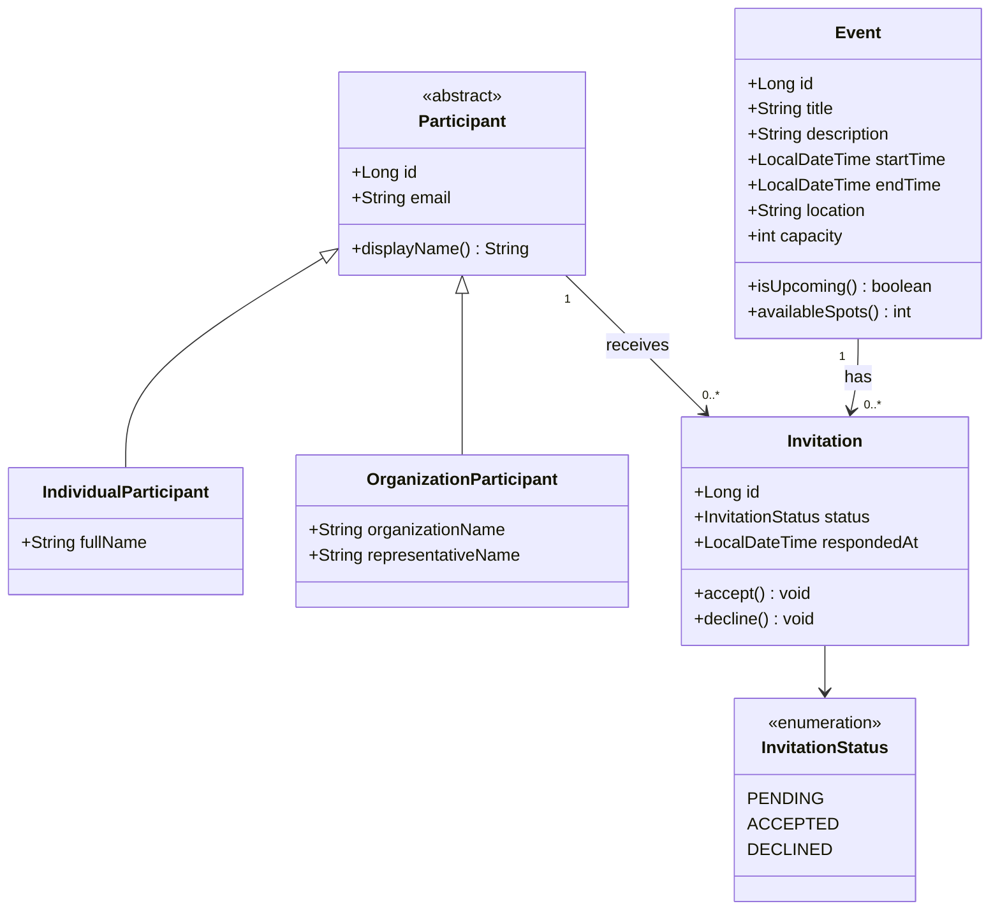
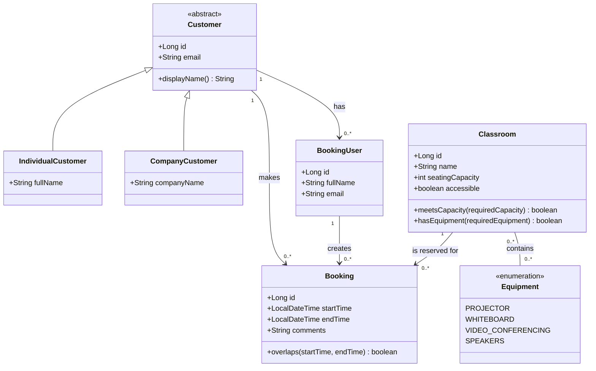

# Project-test-1

## UML Class Diagram — Event Management App

Design rules: an invitation links exactly one participant to one event; the
combination of event and participant must be unique. Only accepted invitations
count toward an event's capacity.

## UML Class Diagram — Classroom Rental App

Design rules: a booking belongs to one customer, is created by one booking user,
and reserves one classroom. A classroom can only be booked when its capacity,
equipment, accessibility, and time availability meet the customer's request.
